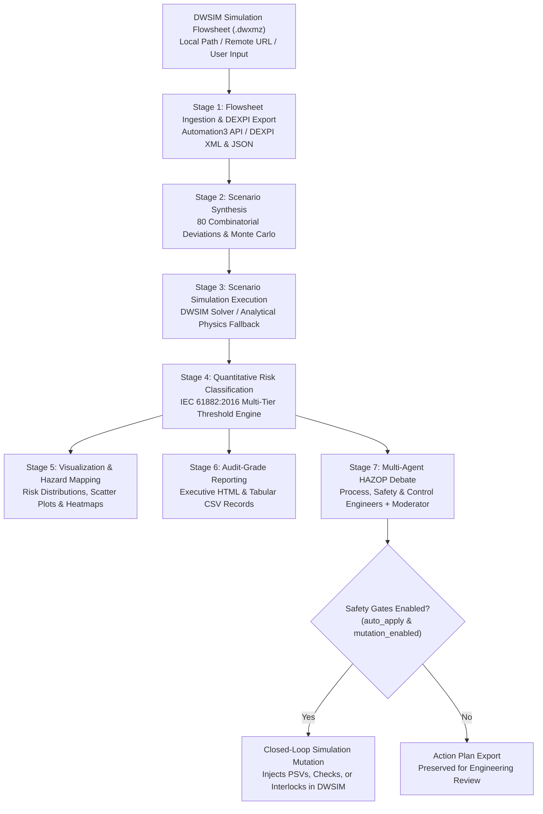

# DWSIM HAZOP Bridge

[](https://www.python.org/)
[](LICENSE)
[](https://www.iec.ch/)
[](https://dexpi.org/)
[](https://dwsim.org/)

**DWSIM HAZOP Bridge** is an automated, closed-loop HAZOP (Hazard and Operability) screening and mitigation framework for chemical process flowsheets modeled in [DWSIM](https://dwsim.org/).

The framework combines deterministic thermodynamic chemical process simulation with contextual multi-agent LLM reasoning to identify operational deviations, quantify process hazards according to international safety standards (**IEC 61882:2016**), debate mitigation strategies across engineering disciplines, and programmatically mutate simulation flowsheets to validate safeguards in closed loop.

---

## ⚡ System Architecture & End-to-End Workflow

The pipeline executes as a coordinated 7-stage lifecycle bridging simulation solvers, topological graph representations, and multi-agent consensus:



---

## 🔬 Pipeline Stages in Detail

### Stage 1: Flowsheet Ingestion & Topology Export
- Connects to DWSIM via the Microsoft .NET / `pythonnet` Automation API (`DWSIM.Automation.Automation3`).
- Interrogates flowsheet topology, mass/energy streams, unit operations (reactors, pumps, valves, heat exchangers), and thermodynamic state properties.
- Normalizes topology into standardized **DEXPI XML** (`Data Exchange in the Process Industry`, ISO 15926-based) and structured JSON for downstream semantic LLM grounding.

### Stage 2: Scenario Generation & Deviation Synthesis
- Anchors against baseline ground-truth operational parameters (`NOMINAL`).
- Generates an 80-scenario combinatorial deviation matrix covering:
  - Single-axis feed flow deviations (zero flow, partial starvation, up to +300% overload, and reverse flow)
  - Cross-feed stoichiometric imbalances (molar ratio excursions)
  - Pump delivery pressure excursions and vacuum conditions
  - Ambient and thermal duty variations
  - Optional Monte Carlo randomized perturbation sampling (`--n-random`).

### Stage 3: Simulation Execution & Physics Fallback
- Executes steady-state and dynamic solves across all synthesized scenarios.
- **Cross-Platform Resilience**: On environments without a local Windows DWSIM installation, Stage 3 transparently utilizes an integrated **analytical physics-based reactor model** fallback, ensuring end-to-end execution across Linux, macOS, and containerized CI/CD environments.

### Stage 4: Quantitative Risk Classification (IEC 61882:2016)
- Evaluates simulation results against strict multi-tier engineering thresholds defined in [`configs/risk_thresholds.json`](configs/risk_thresholds.json):
  - `OK`: Within nominal operating envelopes.
  - `WARNING`: Approaching operational limits (within warning margin).
  - `CRITICAL`: Boundary breached; trip or relief setpoint required.
  - `HAZARDOUS`: Exceeds burst margins or major containment risk.
  - `CATASTROPHIC`: Direct rupture, overpressure surge, or catastrophic vessel failure.
- Features automatic **reverse-flow hazard detection** (critical check-valve failure attribution).

### Stage 5: Engineering Visualizations & Hazard Maps
- Generates publication-ready vector charts and summary cards under `pipeline_output/plots/` and `pipeline_output/images/`:
  - Risk distribution bar charts
  - Pressure vs. mass flow boundary scatter plots
  - Parametric risk matrices and component severity distributions.

### Stage 6: Audit-Grade HAZOP Reporting
- Produces an executive-level, styled HTML audit report (`hazop_report_*.html`) and consolidated CSV summaries.
- Color-coded hazard badges, worst-case scenario attribution, and IEC compliance tables formatted for process safety management (PSM) audits.

### Stage 7: Grounded Multi-Agent LLM Debate & Closed-Loop Mutation
- Automatically triggers bounded debates for any scenario classified at or above configured trigger levels (`CRITICAL`, `HAZARDOUS`, `CATASTROPHIC`).
- **Domain-Specific Personas** ([`configs/personas_config.json`](configs/personas_config.json)):
  - **Process Engineer**: Defends throughput, conversion efficiency, and energy balance; pushes back against unwarranted capital/pressure-drop additions.
  - **Safety Engineer**: Enforces overpressure protection, relief sizing, and reverse-flow check valves; holds strict **veto authority** over unmitigated risks.
  - **Control Engineer**: Focuses on instrumentation coverage, SIL-rated interlocks, sensor placement, and alarm setpoint reconfiguration.
  - **Moderator**: Reaches consensus, respects safety vetoes, and outputs a strictly validated JSON resolution schema (`action`, `target_tag`, `new_tag`, `rationale`).
- **Closed-Loop DWSIM Flowsheet Mutation**: Translates resolutions into live DWSIM API actions (inserting relief valves, configuring check valves, or adjusting setpoints), outputting a timestamped, mutated simulation file without overwriting the baseline flowsheet.

---

## 📁 Repository Layout

```text
DWSIM_Automation/
├── configs/
│   ├── personas_config.json        # Multi-agent persona prompts, veto rules & settings
│   └── risk_thresholds.json        # IEC 61882 engineering limits & back-calculated bounds
├── data/
│   └── dexpi/
│       └── BatchReactor_DEXPI_Export_v2.xml  # Standard DEXPI P&ID topology export
├── src/
│   └── hazop_bridge/
│       ├── dexpi/                  # DEXPI XML context extraction & XML generator
│       │   ├── dexpi_context.py
│       │   └── write_dexpi_xml.py
│       ├── equipment/              # Flowsheet entity resolution & mutation engine
│       │   └── equipment_resolver.py
│       ├── llm/                    # Agent debate engine, LLM client, persona memory
│       │   ├── agent_debate.py
│       │   ├── llm_client.py
│       │   ├── persona_memory.py
│       │   └── resolution_schema.py
│       ├── stages/                 # Sequential pipeline stages (1 through 7)
│       │   ├── stage1_dexpi.py
│       │   ├── stage2_scenarios.py
│       │   ├── stage3_run_scenarios.py
│       │   ├── stage4_analyze.py
│       │   ├── stage5_images.py
│       │   ├── stage6_report.py
│       │   └── stage7_debate.py
│       ├── pipeline_utils.py       # Config loader, logger, timers, flowsheet resolver
│       └── run_full_pipeline.py    # Pipeline orchestrator
├── config.json                     # Central pipeline configuration
├── pyproject.toml                  # Standard Python packaging configuration
├── requirements.txt                # Pinned production dependencies
├── run_full_pipeline.py            # Root convenience CLI entry point
├── LICENSE                         # MIT License
└── README.md                       # System documentation
```

> **Note on Generated Artifacts:** Runtime outputs (`pipeline_output/`, `reports/`, `logs/`, `hazop_debate_reports/`, and `data/flowsheets/`) are created dynamically during execution and are intentionally ignored by Git.

---

## ⚙️ Setup & Installation

### 1. Prerequisites
- **Python**: Version 3.9 or higher.
- **Operating System**:
  - Windows 10/11 is recommended for direct DWSIM COM automation (`pythonnet`).
  - Linux and macOS are fully supported for Stages 2 through 7 via the analytical physics solver fallback.
- **DWSIM** (Optional, for Stage 1 & live flowsheet mutation): [DWSIM v8+](https://dwsim.org/) installed locally.

### 2. Environment Setup

```bash
# Clone the repository
git clone https://github.com/Apratim7104/Agentic-AI-Based-Automation-of-HAZOP-Process.git
cd dwsim-hazop-bridge

# Create and activate a virtual environment
python -m venv venv

# On Windows:
venv\Scripts\activate
# On Linux / macOS:
source venv/bin/activate
```

### 3. Install Dependencies

Install dependencies directly or install the package in editable mode:

```bash
pip install -r requirements.txt
pip install -e .
```

### 4. Configure Environment Variables

Copy the example environment template and configure your LLM credentials (required for Stage 7):

```bash
cp .env.example .env
```

Edit `.env`:
```env
LLM_API_KEY=your-api-key-here
LLM_BASE_URL=...
LLM_MODEL=...
```

---

## 🚀 Running the Pipeline

### Flowsheet Ingestion Options

The pipeline dynamically accepts simulation flowsheets via command-line arguments, remote URLs, or interactive prompts:

#### 1. Interactive Ingestion (Default)
If no flowsheet path is provided and `config.json` contains a placeholder, the pipeline automatically prompts you:
```bash
python run_full_pipeline.py
# Prompt: Enter DWSIM Simulation Flowsheet URL or file path:
```

#### 2. Command-Line Path
Supply a local path directly:
```bash
python run_full_pipeline.py "C:\Simulations\Batch_Reactor.dwxmz"
# or using flags:
python run_full_pipeline.py --flowsheet "C:\Simulations\Batch_Reactor.dwxmz"
```

#### 3. Remote URL Ingestion
Pass a direct download link (`http://` or `https://`). The pipeline automatically downloads and caches the flowsheet in `data/flowsheets/`:
```bash
python run_full_pipeline.py --flowsheet "https://example.com/models/Batch_Reactor.dwxmz"
```

---

### Command-Line Execution Options

```bash
# Execute the full pipeline (Stages 1 through 7)
python run_full_pipeline.py

# Run without DWSIM installed (skip Stage 1 DEXPI export, use analytical simulation)
python run_full_pipeline.py --skip-stage1

# Start from a specific stage (e.g., Stage 4 analysis)
python run_full_pipeline.py --start-stage 4

# Stop execution after reporting (skip LLM debate)
python run_full_pipeline.py --stop-stage 6

# Execute specific stage range (e.g., Stages 2 to 6)
python run_full_pipeline.py --start-stage 2 --stop-stage 6

# Regenerate deviation scenarios with 150 Monte Carlo randomized cases
python run_full_pipeline.py --regenerate-scenarios --n-random 150

# Use a custom configuration file
python run_full_pipeline.py --config my_custom_config.json
```

---

## 🛡️ Safety Gates & Flowsheet Mutation Control

Applying automated mutations to engineering flowsheets is protected behind **two independent safety gates** in [`config.json`](config.json):

```json
"llm": {
  "auto_apply_equipment_changes": false,
  "dwsim_mutation_enabled": false
}
```

- **Gate 1 (`auto_apply_equipment_changes`)**: Determines whether Stage 7 triggers the mutation engine upon reaching consensus.
- **Gate 2 (`dwsim_mutation_enabled`)**: Hard safety interlock inside [`equipment_resolver.py`](src/hazop_bridge/equipment/equipment_resolver.py).
- When either gate is `false`, the pipeline **never touches the simulation flowsheet** and instead outputs a structured mutation plan JSON under `pipeline_output/equipment_changes/plans/` for human engineer sign-off.
- When enabled, mutations are saved to a **new timestamped flowsheet copy**; the baseline file is never overwritten.

---

## 📊 Output Artifacts

| Directory | Contents | Description |
|---|---|---|
| `pipeline_output/` | `scenario_results_summary.csv`, `.xlsx` | Comprehensive tabular simulation outputs for all scenarios |
| `pipeline_output/plots/` | `*.png` | Risk distributions, pressure profiles, and correlation charts |
| `reports/` | `hazop_report_*.html` | Formatted audit-ready HAZOP executive summary |
| `pipeline_output/hazop_debate_reports/` | `*_debate_summary.csv`, `.xlsx` | Full multi-turn debate transcripts, stances, and moderator resolutions |
| `pipeline_output/equipment_changes/` | `plan_*.json` or mutated `.dwxmz` | Programmatic mitigation plans and validated mutated flowsheets |
| `logs/` | `orchestrator.log`, `stage*.log` | Detailed execution traces and stage timing diagnostics |

---

## 📄 License

This project is licensed under the MIT License — see the [LICENSE](LICENSE) file for details.
